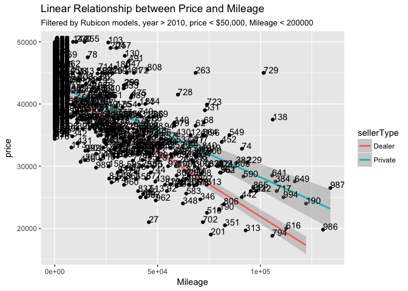

autotradeR: an R package to get data from autotrader.com
========================================================

Description
-----------

In development R package for scraping autotrader.com and analyzing car prices. Make queries to autotrader and return ALL data from multiple listings for each query (1000 max per query). You can search for specific makes and models for any zipcode in the US. The scraping functionality is built using the rvest package (fantastic stuff), and some more advanced scraping is done with Python 3+ using selenium with a chromedriver.

This package is under development and currently is not formatted as a package. Please wait for a bit while I go ahead and do that.

How to use
----------

For now install all the necessary libraries and source all of the R function files in the backend R folder. Then use autotrader\_scrape() as the main function to make scraping calls. use args(autotrader\_query) to see what query parameters you can use. I'll build this into a full package soon, so sit tight!

See example in ScrapeExample.R

``` r
library(tidyverse)
```

    ## ── Attaching packages ───────────────────────────────────────────────────────────────────────────── tidyverse 1.2.1 ──

    ## ✔ ggplot2 2.2.1     ✔ purrr   0.2.4
    ## ✔ tibble  1.4.2     ✔ dplyr   0.7.4
    ## ✔ tidyr   0.8.0     ✔ stringr 1.3.0
    ## ✔ readr   1.1.1     ✔ forcats 0.3.0

    ## ── Conflicts ──────────────────────────────────────────────────────────────────────────────── tidyverse_conflicts() ──
    ## ✖ dplyr::filter() masks stats::filter()
    ## ✖ dplyr::lag()    masks stats::lag()

``` r
library(rvest) # read_html functions and the like
```

    ## Loading required package: xml2

    ## 
    ## Attaching package: 'rvest'

    ## The following object is masked from 'package:purrr':
    ## 
    ##     pluck

    ## The following object is masked from 'package:readr':
    ## 
    ##     guess_encoding

``` r
library(httr)
library(pbapply) # For progress bars in queries
library(parallel) # For parallel processing

# Currently this is not built as a package yet, so just source all the files in the functions folder
source("R/Functions/autoTrader_scrape.R")
source("R/Functions/autoTrader_query.R")
source("R/Functions/data_clean.R")
source("R/Functions/info_extractors.R")
source("R/Functions/scrape_utils.R")

ProvoJeepP <- autoTrader_scrape(make = "Jeep", model = "Wrangler", zip = 84604, pages = "all",
                  sellerType = "p", locationName = "Provo", fork = 8)
```

    ## Using 8 core(s) to scrape links

``` r
head(ProvoJeepP)
```

    ## # A tibble: 6 x 32
    ##   rowNum listing_title listing_distanc… listing_url price listingPriceRedu
    ##    <int> <fct>                    <dbl> <chr>       <dbl> <lgl>           
    ## 1      1 Used 2012 Je…                9 /cars-for-… 39500 FALSE           
    ## 2      2 Used 2015 Je…               12 /cars-for-… 21999 FALSE           
    ## 3      3 Used 2008 Je…               15 /cars-for-… 15900 FALSE           
    ## 4      4 Used 2016 Je…               15 /cars-for-… 80000 FALSE           
    ## 5      5 Used 2014 Je…               20 /cars-for-… 57000 FALSE           
    ## 6      6 Used 2006 Je…               31 /cars-for-… 49750 FALSE           
    ## # ... with 26 more variables: `Body Style` <fct>, `Drive Type` <fct>,
    ## #   Engine <fct>, Mileage <dbl>, Transmission <fct>, `ATC Car ID` <chr>,
    ## #   Fuel <chr>, `Stock #` <chr>, VIN <chr>, carFeaturesText <chr>,
    ## #   exterior <fct>, interior <chr>, sellerComment <chr>, `Basic
    ## #   Warranty` <lgl>, `Corrosion Warranty` <lgl>, `Drivetrain
    ## #   Warranty` <lgl>, `Roadside Assistance Warranty` <lgl>,
    ## #   newListingIndicator <fct>, Dealer <fct>, model <chr>, year <dbl>,
    ## #   ownershipStatus <chr>, Location <chr>, sellerType <chr>,
    ## #   CityMpg <dbl>, HyMpg <dbl>

This queries autotrader for 1000 maximum results for Jeep Wranglers around 86404 in ascending distance. Private sellers are specified, and the tag "Provo" is added in locationName as a column value that can be unique for this query. The result is a tidy tibble with 32 columns of information. about the listing. The fork argument specifies how many cores will be used to parallelize the web scraping of autotrader.com. Please be kind to their servers, I have not yet written code for this package that behaves well in not making too many requests at once. This specific query will use 8 cores available to parallelize the scraping.

Example analysis
----------------

``` r
read_csv("Data/JeepData_05-11-18.csv") %>%
  distinct(VIN, .keep_all = TRUE) %>% 
  filter(!is.na(sellerType),
         Mileage < 200000,
         price < 50000,
         year > 2010,
         grepl("Rubicon", as.character(model))) %>%
  ggplot(aes(x = Mileage, y = price)) +
  geom_point() +
  geom_smooth(method = "lm", aes(col = sellerType)) +
  geom_text(aes(label = rowNum), hjust=0, vjust=0) + 
  ggtitle("Linear Relationship between Price and Mileage",
          subtitle = "Filtered by Rubicon models, year > 2010, price < $50,000, Mileage < 200000")
```

    ## Parsed with column specification:
    ## cols(
    ##   .default = col_character(),
    ##   rowNum = col_integer(),
    ##   listing_distance_miles = col_double(),
    ##   price = col_double(),
    ##   listingPriceRedu = col_logical(),
    ##   Mileage = col_double(),
    ##   newListingIndicator = col_logical(),
    ##   year = col_double(),
    ##   CityMpg = col_integer(),
    ##   HyMpg = col_integer()
    ## )

    ## See spec(...) for full column specifications.

 Here we can see that Private sellers significantly overprice Dealers for used Jeep Wrangler Rubicons. Powerful stuff here...
